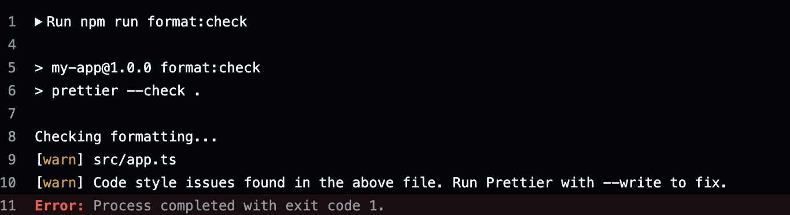

# CI/CD 作業報告

**學號：** B12705061  
**姓名：** 黃聖家  
**日期：** 2026-05-15

---

## 一、CI Pipeline 說明

### 1.1 Workflow 檔案內容

檔案路徑：`.github/workflows/ci_B12705061.yaml`

```yaml
name: CI B12705061

on:
  push:
    branches:
      - '**'
  pull_request:

jobs:
  ci:
    runs-on: ubuntu-latest

    steps:
      - name: Checkout code
        uses: actions/checkout@v4

      - name: Setup Node.js
        uses: actions/setup-node@v4
        with:
          node-version: '22'
          cache: 'npm'

      - name: Install dependencies
        run: npm ci

      - name: TypeScript typecheck
        run: npm run typecheck

      - name: Prettier format check
        run: npm run format:check

      - name: Run tests
        run: |
          mkdir -p reports
          npm test -- --reporter=default --reporter=junit --outputFile.junit=reports/vitest-junit.xml

      - name: Publish test results
        if: always()
        uses: mikepenz/action-junit-report@v4
        with:
          report_paths: reports/vitest-junit.xml
          check_name: Vitest Test Results
          fail_on_failure: true

      - name: Upload test report artifact
        if: always()
        uses: actions/upload-artifact@v4
        with:
          name: test-report
          path: reports/
          if-no-files-found: error
```

### 1.2 Pipeline 設計說明

#### 觸發條件

Pipeline 設定在 **所有 branch 的 push 事件**以及 **Pull Request** 時自動執行：

```yaml
on:
  push:
    branches:
      - '**' # 萬用字元，涵蓋所有分支
  pull_request:
```

#### 執行環境

使用 `ubuntu-latest` 作為 runner，搭配 Node.js 22（符合專案 `engines` 要求），並啟用 npm cache 加速套件安裝。

#### 步驟流程

| #   | 步驟名稱                    | 使用工具                          | 說明                                                       |
| --- | --------------------------- | --------------------------------- | ---------------------------------------------------------- |
| 1   | Checkout code               | `actions/checkout@v4`             | 將 repository 程式碼 clone 至 runner                       |
| 2   | Setup Node.js               | `actions/setup-node@v4`           | 安裝 Node.js 22，啟用 npm cache                            |
| 3   | Install dependencies        | `npm ci`                          | 依照 `package-lock.json` 安裝套件，確保版本一致            |
| 4   | TypeScript typecheck        | `npm run typecheck`               | 執行 `tsc --noEmit`，檢查型別錯誤，不輸出編譯結果          |
| 5   | Prettier format check       | `npm run format:check`            | 執行 `prettier --check .`，驗證所有檔案格式是否符合規範    |
| 6   | Run tests                   | `npm test` + JUnit reporter       | 執行 Vitest 測試，同時輸出 JUnit XML 報告至 `reports/`     |
| 7   | Publish test results        | `mikepenz/action-junit-report@v4` | 解析 JUnit XML，將測試結果顯示於 GitHub Actions Check 頁面 |
| 8   | Upload test report artifact | `actions/upload-artifact@v4`      | 上傳原始 XML 報告，供後續下載查閱                          |

#### 失敗機制

- 步驟 4～6 任一失敗，GitHub Actions job 會立即標記為 **failed**，後續步驟（7、8）因預設行為不執行。
- 步驟 7 設有 `fail_on_failure: true`，若測試有失敗案例，Check 頁面亦顯示紅色失敗狀態。
- 步驟 7、8 設有 `if: always()`，確保即使測試失敗，報告仍會上傳至 GitHub，方便檢視失敗詳情。

#### 測試結果顯示策略

採用雙重輸出策略：

1. **`mikepenz/action-junit-report@v4`**：將 JUnit XML 解析後整合至 GitHub Actions 的 Checks 頁面，可直接在 PR 或 commit 頁面看到每個測試案例的通過／失敗狀態。
2. **`actions/upload-artifact@v4`**：保存原始 XML 報告，可在 Actions Run 頁面下載，方便離線分析。

---

## 二、CI 執行結果截圖

### 2.1 成功執行截圖

> **【請在此插入截圖】**  
> 截圖內容：GitHub Actions 頁面顯示所有步驟皆為綠色勾號（✓），job 狀態為 `Success`。

Pipeline 成功執行時，所有步驟依序通過：

- ✅ Checkout code
- ✅ Setup Node.js
- ✅ Install dependencies
- ✅ TypeScript typecheck — `tsc --noEmit` 無型別錯誤
- ✅ Prettier format check — 所有檔案格式符合規範
- ✅ Run tests — 2 個測試案例全數通過
- ✅ Publish test results — Vitest Test Results Check 顯示通過
- ✅ Upload test report artifact — 報告上傳成功

### 2.2 測試結果顯示於 GitHub Actions

> **【請在此插入截圖】**  
> 截圖內容：GitHub Actions Checks 頁面中，「Vitest Test Results」區塊展開後，顯示各個測試案例（`GET /health returns ok status`、`GET / returns app message and version`）皆為通過狀態。

本 Pipeline 使用 `mikepenz/action-junit-report@v4` 將 Vitest 的 JUnit XML 輸出解析後，整合顯示於 GitHub Actions 的 Check 頁面。測試報告可在 Actions Run 頁面的 Artifacts 區塊下載（`test-report.zip`）。

---

## 三、失敗案例說明

以下示範三種常見的 CI 失敗情境，分別對應 TypeScript 型別錯誤、Prettier 格式錯誤、測試失敗。

---

### 案例一：TypeScript 型別錯誤

#### 製造錯誤方式

在 `src/app.ts` 中故意將回傳型別寫錯，例如將字串值賦予數字型別變數：

```typescript
// 故意加入型別錯誤
const version: number = 'this-is-a-string';
```

#### 錯誤原因

`tsc --noEmit` 執行時，TypeScript 編譯器偵測到型別不符合（`Type 'string' is not assignable to type 'number'`），回傳非零 exit code，導致 step **TypeScript typecheck** 失敗，整個 job 標記為 `failed`。

#### CI 顯示的錯誤訊息

```
Run npm run typecheck

> my-app@1.0.0 typecheck
> tsc --noEmit

src/app.ts(5,7): error TS2322: Type 'string' is not assignable to type 'number'.
Error: Process completed with exit code 1.
```

> **【請在此插入截圖】**  
> 截圖內容：GitHub Actions 頁面中，`TypeScript typecheck` 步驟顯示紅色 ✗，後續步驟未執行，job 整體狀態為 `Failure`。

#### 修正方式

將錯誤的型別宣告改回正確型別，或移除多餘的宣告，重新 push 後 pipeline 自動重跑即可恢復正常。

---

### 案例二：Prettier 格式錯誤

#### 製造錯誤方式

在 `src/app.ts` 中故意打亂縮排或移除分號，違反 `.prettierrc` 規範（`semi: true`, `singleQuote: true`, `printWidth: 100`）：

```typescript
// 故意使用雙引號（違反 singleQuote: true）
import Fastify from 'fastify';
```

#### 錯誤原因

`prettier --check .` 發現檔案格式與規範不符，回傳非零 exit code，step **Prettier format check** 失敗。

#### CI 顯示的錯誤訊息

```
Run npm run format:check

> my-app@1.0.0 format:check
> prettier --check .

Checking formatting...
[warn] src/app.ts
[warn] Code style issues found in 1 file. Run Prettier with --write to fix.
Error: Process completed with exit code 1.
```

截圖內容：GitHub Actions 頁面中，`Prettier format check` 步驟顯示紅色 ✗，job 整體狀態為 `Failure`。



#### 修正方式

在本機執行 `npm run format` （即 `prettier --write .`）自動修正格式，再重新 commit 並 push。

---

### 案例三：測試失敗

#### 製造錯誤方式

修改 `test/app.test.ts` 中的預期值，使其與實際 API 回應不符：

```typescript
// 故意把預期狀態碼改為錯誤的值
expect(response.statusCode).toBe(404); // 實際應為 200
```

#### 錯誤原因

Vitest 執行時，`GET /health returns ok status` 測試案例斷言失敗（`expected 200 to be 404`），回傳非零 exit code，step **Run tests** 失敗。同時 `mikepenz/action-junit-report@v4` 解析 JUnit XML 後，在 GitHub Checks 頁面標記該測試案例為失敗。

#### CI 顯示的錯誤訊息

```
Run npm test -- --reporter=default --reporter=junit ...

> my-app@1.0.0 test
> vitest run

 FAIL  test/app.test.ts > Fastify app > GET /health returns ok status
AssertionError: expected 200 to be 404

 Test Files  1 failed (1)
      Tests  1 failed | 1 passed (2)
Error: Process completed with exit code 1.
```

> **【請在此插入截圖】**  
> 截圖內容一：GitHub Actions 頁面中，`Run tests` 步驟顯示紅色 ✗，job 整體狀態為 `Failure`。  
> 截圖內容二：GitHub Actions Checks 頁面中，「Vitest Test Results」顯示 1 個測試失敗，並列出失敗的測試案例名稱與錯誤訊息。

#### 修正方式

將測試中錯誤的預期值改回正確值（`toBe(200)`），重新 commit 並 push，pipeline 重跑後測試恢復通過。

---

## 四、實作工具與策略總結

| 項目            | 工具／策略                                   | 說明                                                  |
| --------------- | -------------------------------------------- | ----------------------------------------------------- |
| CI 平台         | GitHub Actions                               | 使用 `.github/workflows/` 目錄下的 YAML 定義 pipeline |
| 觸發策略        | `push: branches: '**'` + `pull_request`      | 涵蓋所有分支，確保每次提交都經過驗證                  |
| TypeScript 檢查 | `tsc --noEmit`                               | 不產生輸出檔案，純粹驗證型別正確性                    |
| 格式檢查        | `prettier --check .`                         | 驗證風格一致性，不自動修改                            |
| 測試執行        | Vitest + JUnit reporter                      | 雙 reporter 同時輸出終端結果與 XML 報告               |
| 測試結果展示    | `mikepenz/action-junit-report@v4`            | 將 JUnit XML 整合至 GitHub Checks UI                  |
| 報告保存        | `actions/upload-artifact@v4`                 | 保存原始 XML 報告供下載                               |
| 失敗保證        | 預設步驟失敗即中止 + `fail_on_failure: true` | 任一檢查失敗，pipeline 整體顯示失敗                   |
